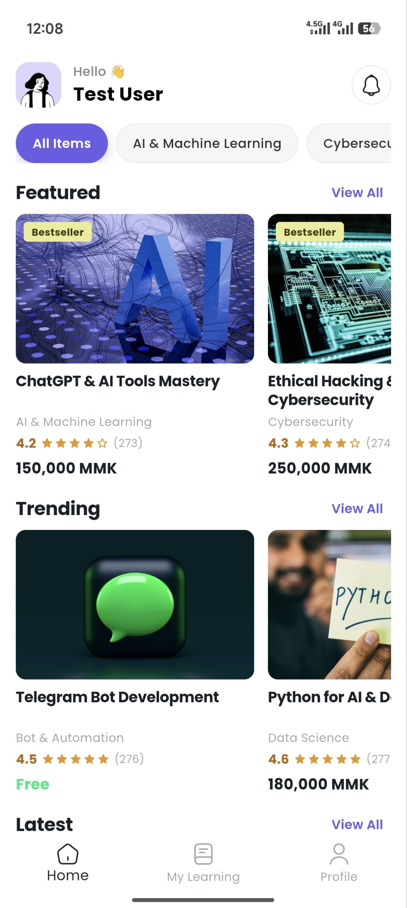
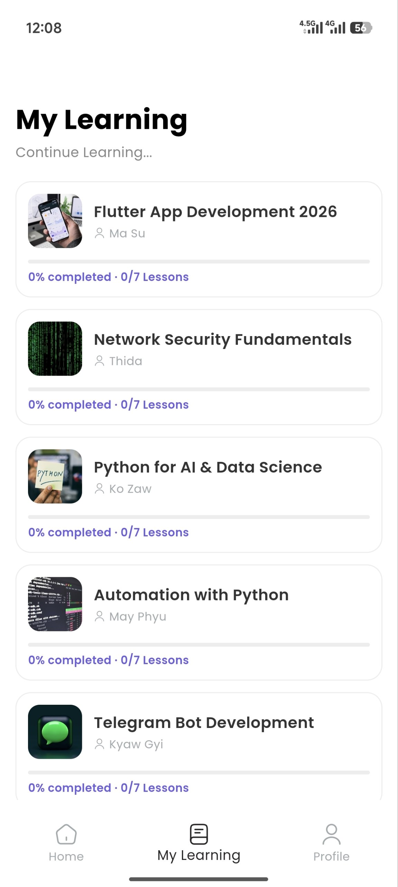
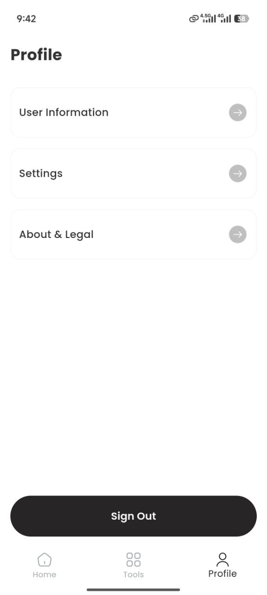
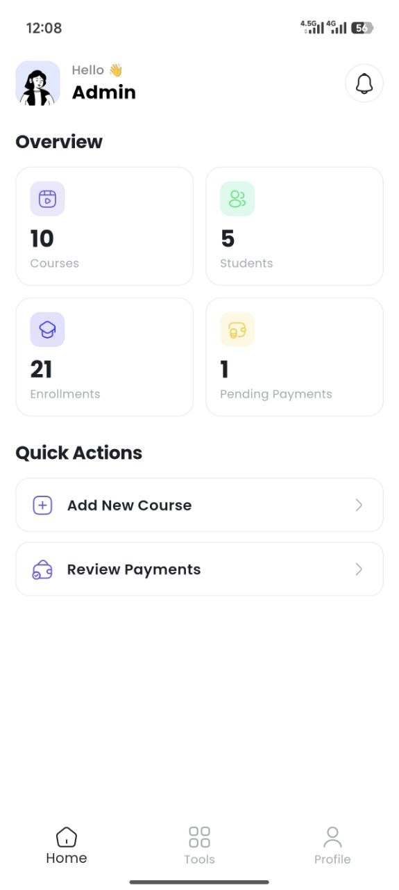
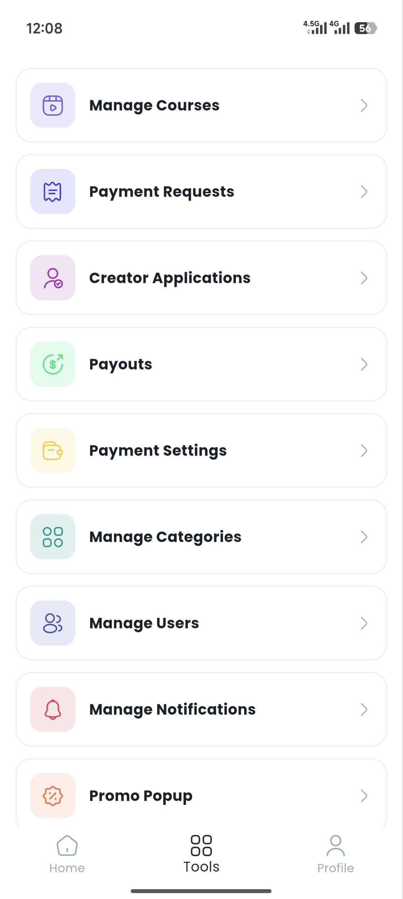
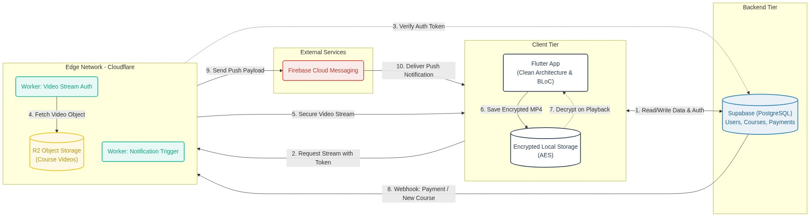

# Pann Lab — Online Course Marketplace

ဒီအပတ်ထဲ အချိန်လေး နည်းနည်းရတာနဲ့ ကိုယ်ပိုင် Challenge တစ်ခုအနေနဲ့ Udemy လို Online Course Platform လေးတစ်ခု စမ်းရေးဖြစ်ခဲ့ပါတယ်။ User တွေ Course ဝယ်ယူလေ့လာလို့ရသလို၊ Creator တွေကိုယ်တိုင်လည်း Course တင်ပြီး ရောင်းလို့ရတဲ့ Digital Marketplace ပုံစံမျိုးလေးပါ။

သုံးထားတဲ့ Tech Stack ကတော့ Flutter ကို Clean Architecture (BLoC Pattern) နဲ့ရေးပြီး Backend အတွက် Supabase ကို သုံးထားပါတယ်။ Course, User, Payment လို Relational Data တွေကို SQL နဲ့ ကိုင်တွယ်တာ ပိုအဆင်ပြေမယ် ထင်လို့ Firebase အစား Supabase ကို ရွေးဖြစ်ခဲ့တာပါ။

(ဒီ Repo မှာ စာနဲ့ Screenshot တွေပဲ တင်ထားတာပါ။ Source code တွေ မပါပါဘူး။)

## Screenshots

User App:

  
  
  

Admin / Creator:

  
  

## System Architecture

## လုပ်ရင်း ရခဲ့တဲ့ သင်ခန်းစာတွေ

ပထမဆုံး ဝန်ခံရရင် ကျွန်တော်က Professional Developer တစ်ယောက်တော့ မဟုတ်ပါဘူး။ ဝါသနာပါလို့ လေ့လာရင်း AI (အဓိက Claude) အကူအညီနဲ့ စမ်းလုပ်ကြည့်ထားတာပါ။ အစကတော့ သိပ်မခက်လောက်ဘူး ထင်ခဲ့တာပါ။ တကယ်တမ်း လက်တွေ့လုပ်ကြည့်တော့မှ Code ရေးရတဲ့ အပိုင်းထက် System Design ပိုင်းမှာ ခေါင်းစားစရာတွေ အများကြီး ရှိမှန်း သိလာရပါတယ်။ ဘယ် Architecture ကို သုံးမလဲ၊ ဘာကြောင့် သုံးသင့်တာလဲ၊ ဘယ်နေရာတွေမှာ error တက်နိုင်လဲဆိုတာ ကြိုတွေးရတဲ့အပိုင်းက ပိုခက်ပါတယ်။

အဓိကကတော့ Course Video တွေ Stream လုပ်တဲ့အပိုင်းပါ။ Video Stream လုပ်ရင် Bandwidth (Egress) Cost က အသေအလဲ တက်နိုင်ပါတယ်။ ဒါကြောင့် Egress free ဖြစ်တဲ့ Cloudflare R2 ကို သုံးခဲ့ပါတယ်။ ဒါပေမယ့် ပိုက်ဆံပေးပြီး ကြည့်ရတဲ့ Course တွေဖြစ်လို့ Public အလွယ်တကူ ပေးကြည့်လို့ မရပါဘူးလေ။ ဒါကြောင့် ကြားထဲမှာ Cloudflare Worker ကိုခံ၊ User ရဲ့ Token ကို စစ်၊ တကယ် ဝယ်ထားတဲ့သူ (Enroll လုပ်ထားသူ) ကိုမှ Video Stream ခွင့်ပေးတဲ့ ပုံစံမျိုး ရေးခဲ့ရပါတယ်။ Video ရဲ့ Original Link ကို လုံးဝ မပေးဘဲ Worker ကနေပဲ ဖြတ်ခိုင်းတာပါ။ Worker ဆိုတာကလည်း Public URL ဖြစ်နေတော့ ဘယ်သူမဆို လှမ်းခေါ်လို့ ရနေပြန်ပါတယ်။ ဒါကြောင့် Worker တိုင်းမှာ Request ဝင်လာတာနဲ့ User ရဲ့ Supabase Token ကို အရင်ဆုံး စစ်ဖို့ လုပ်ရပါတယ်။ Token အမှန်ဖြစ်မှ၊ တကယ် ဝယ်ထားမှ Stream ခွင့်ပေးတာ၊ Upload လုပ်ခွင့်ပေးတာမျိုးပေါ့။

နောက်ထပ် အသုံးအဝင်ဆုံး သင်ခန်းစာတစ်ခုကတော့ Security ပိုင်းပါ။ Notification ပို့ဖို့ FCM ကို လှမ်းခေါ်ရင် Firebase ရဲ့ API Key (Private Key) လိုပါတယ်။ အစကတော့ အဲဒီ API Key ကို App Code ထဲမှာပဲ ထည့်ပြီး Build လုပ်တဲ့အခါ Reverse လုပ်ရခက်အောင်လုပ်ပြီး ဒီအတိုင်းပဲ ထည့်ခဲ့ဖို့ တွေးမိပါသေးတယ်။ ဒါပေမယ့် သေချာ ပြန်စဉ်းစားကြည့်တော့ White Box Test လုပ်တဲ့ ဒီခေတ်ကြီးထဲမှာ အသာလေး Reverse ပြန်လုပ်ပြီး Key ကို ဆွဲထုတ်လို့ ရမှန်း ပြန်တွေးမိပါတယ်။ App ထဲသာ Key ပါသွားရင် တစ်ယောက်ယောက်က ဆွဲထုတ်ပြီး ကျွန်တော့် Notification တွေကို စိတ်ကြိုက် လှမ်းပို့လို့ ရသွားမှာပါ။

ဒါကြောင့် Notification ပို့တဲ့ Logic တစ်ခုလုံးကို Cloudflare Worker ဆီ ရွှေ့လိုက်ပါတယ်။ App ကနေ Worker ကိုပဲ လှမ်းခေါ်၊ Worker ကမှ တကယ် Admin ဟုတ်မဟုတ် စစ်ပြီးမှ Notification ပို့ခွင့်ပေးပါတယ်။ Secret တွေ အကုန်လုံးကိုလည်း Code ထဲမှာ Hardcode မရေးတော့ဘဲ Worker Environment Secret အနေနဲ့ပဲ ထားခဲ့ပါတယ်။ "Client App ထဲမှာ Server Secret တွေ ဘယ်တော့မှ မထားရဘူး" ဆိုတဲ့ စာအုပ်ထဲက စကားကို ကိုယ်တိုင် လုပ်ကြည့်တော့မှ ပိုပြီး နားလည်သွားပါတယ်။

Video တွေကို ကာကွယ်တဲ့ အပိုင်းမှာလည်း အင်တာနက် မကောင်းတဲ့ အချိန်တွေအတွက် Offline ကြည့်လို့ရဖို့က မရှိမဖြစ်ပါပဲ။ ဒါပေမယ့် ရိုးရိုးကြီး Download ချပေးလိုက်ရင် Video ဖိုင်တွေက ဖုန်းထဲရောက်သွားပြီး အလွယ်တကူ ခိုးကူးခံရနိုင်ပါတယ်။ ဒါကြောင့် Download ဆွဲတဲ့အခါ AES Encryption နဲ့ Encrypt လုပ်ပြီး App ရဲ့ Private Directory ထဲမှာပဲ ဝှက်ပြီး သိမ်းထားလိုက်ပါတယ်။ ပြန်ကြည့်မှ App ထဲမှာ Decrypt ပြန်လုပ်ပြီး ပြပေးတာမို့ File Manager ကနေ ဝင်ယူလို့ မရတော့ပါဘူး။ ဒါပေမယ့် Screen Record ဖမ်းတာ၊ Screenshot ရိုက်တာတွေကိုပါ ကာကွယ်ဖို့ Android ရဲ့ FLAG_SECURE ကိုပါ ထပ်သုံးခဲ့ရပါတယ်။ Content Security နဲ့ User Experience ကြားမှာ ချိန်ညှိရတာ တော်တော်လေး ခေါင်းစားခဲ့ရပါတယ်။

AI နဲ့ ပတ်သက်ပြီး သတိထားမိတာလေးလည်း ရှိပါသေးတယ်။ Payment Approve လုပ်တဲ့ Code ကို AI ဆီကပဲ အကူအညီတောင်းပြီး ရေးခဲ့ပါတယ်။ Code က သပ်သပ်ရပ်ရပ်နဲ့ အလုပ်လုပ်ပါတယ်။ ဒါပေမယ့် သေချာ ပြန်တွေးကြည့်တော့ "Admin က Approve ခလုတ်ကို မတော်တဆ နှစ်ခါ ဆက်တိုက် နှိပ်မိသွားရင် ဘာဖြစ်မလဲ" ပေါ့။ AI ရေးပေးထားတဲ့ Code ထဲမှာ အဲဒီလို အခြေအနေအတွက် (Idempotent ဖြစ်အောင်) မစစ်ထားတော့ Creator ရဲ့ ဝင်ငွေက နှစ်ဆ တက်သွားနိုင်ပါတယ်။ ဒါက ငွေကြေးနဲ့ ပတ်သက်လာရင် တော်တော် ပြဿနာတက်နိုင်တဲ့ Bug ပါ။ ဒါကြောင့် ဘယ်နှစ်ခါ နှိပ်နှိပ် တစ်ခါပဲ အလုပ်လုပ်အောင် Database Unique Constraint တွေနဲ့ ပြန်ပြင်ခဲ့ရပါတယ်။ Database ဘက်မှာလည်း RLS (Row Level Security) တွေ သေချာချပြီး ကိုယ့် Data ကိုယ်ပဲ မြင်ရအောင် သေချာ ပြန်လုပ်ခဲ့ရပါတယ်။

နိဂုံးချုပ်အနေနဲ့ ပြောရရင် "AI ခေတ်မှာ Domain Knowledge က ပိုပြီး အရေးကြီးလာပါတယ်"။ AI က ကိုယ်လိုချင်တဲ့ Code ကို အလွယ်တကူ ရေးပေးနိုင်ပါတယ်။ ဒါပေမယ့် "Payment Logic ကို ဘယ်လို စစ်ရမယ်"၊ "API Key ကို Client ထဲ မထားရဘူး"၊ "API တွေကို ဘယ်လို ကာကွယ်ရမယ်" ဆိုတဲ့ ဆုံးဖြတ်ချက်တွေက လူကပဲ ဦးဆောင်ပြီး ချရတာပါ။ Code ရေးရတာက အခုခေတ်မှာ လွယ်သွားပါပြီ။ တကယ်ခက်တာက ဘယ်နေရာမှာ ဘာတွေ မှားနိုင်လဲ၊ ဘာတွေကို ကြိုပြီး ကာကွယ်ထားရမလဲ ဆိုတာကို ကြိုမြင်နိုင်တဲ့ Domain Knowledge ပါပဲ။ AI က ပြဿနာကို ကိုယ်တိုင် လိုက်ရှာမပေးပါဘူး၊ ကိုယ်က မေးတတ်မှ ဖြေပေးတာပါ။ ဒါကြောင့် ကိုယ့်ဘက်က အခြေခံ နားလည်ထားမှု (Domain Knowledge) ရှိနေမှ AI ကို ပိုပြီး ထိထိရောက်ရောက် အသုံးချနိုင်မယ် ဆိုတာ ဒီ Project လေးကနေ သေချာ သိလိုက်ရပါတယ်။
